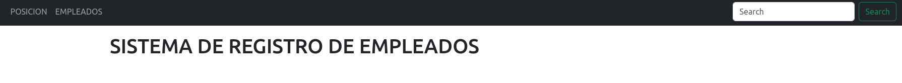
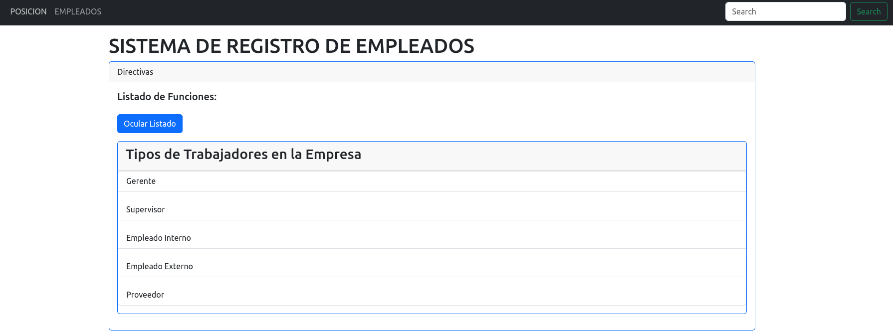
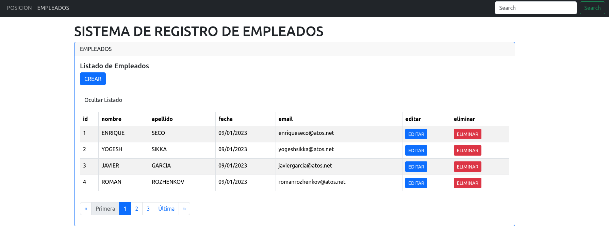

# EMPLOYEE MANAGER

This is a comprehensive web application for managing employees. The project utilizes the [Spring](https://spring.io/) Framework for [Java](https://www.java.com/en/) on the backend side and [Angular](https://angular.io/) in the frond side, with [Boostrap](https://getbootstrap.com/) and [sweetalert2](https://sweetalert.js.org/).

## Table of Contents

1. [Technologies Used](#technologies-used)
2. [Features](#features)
3. [Getting Started](#getting-started)
6. [License](#license)

## Technologies Used

1. Angular Frontend
- **HTML/CSS**
- **Bootstrap**
- **Sweetalert2**
- **Typescript**
- **Angular CLI**

2. Spring Backend
- **Java**
- **Spring Framework**
- **Spring MVC**
- **Spring Boot**
- **Hibernate**
- **Maven**

## Features

The app offers a wide range of features to help you efficiently manage your employees, including:

- **Position Information:** Store and organize essential position details.

- **Employee Information:** Store and organize essential employee details.

## Getting Started

To run this project locally, follow these steps:

1. Clone the repository
2. Open the backend with an IDE like IntelliJ, Eclipse, STS4, etc.
3. Open the frontend with a text editor like VSCode or the IDE you want.
4. Build and run the project at the backed side.
5. In the front side I run ng serve -o command to run the front with live server plugin for VSC.
6. The browser is going to open at the port http://localhost:4200/

## License

This project is licensed under the [MIT License](LICENSE).
